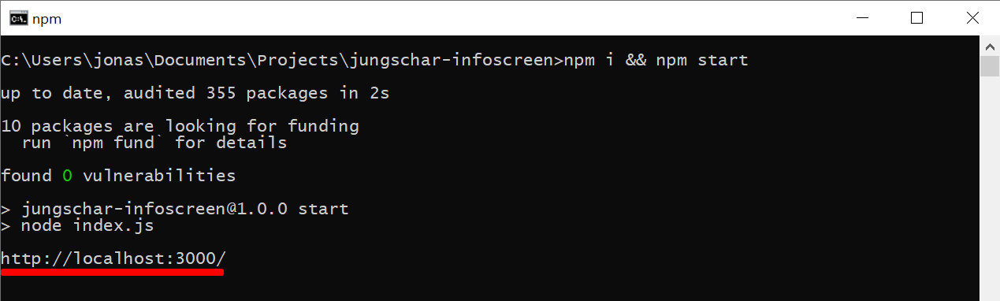

# Jungschar-Infoscreen

## Beschreibung

Jungschar-Infoscreen ist ein Software-Produkt welches die Verwaltung und Durchführung einer Spielestadt oder ähnlichen Aktivitäten erleichtert. Es gibt eine Ansicht für Kinder wo Sie aktuelle Informationen, wie das Wetter, die aktuelle Uhrzeit oder Bilder der vergangenen Woche, ansehen können. Die Inhalte können von Kinder erstellt und bedient werden, auch während der Aktion. Jungschar-Infoscreen richtet sich an GruppenleiterInnen und Kinder. Das Ziel ist es, bei der Organisation bzw. Durchführung unterstützt zu werden.

## Installation

Für die Erstinstallation ist Internet erforderlich. 

Jungschar-Infoscreen kann hier heruntergeladen werden.

Während die Dateien herunterladen öffnen Sie ein Terminal Fenster, um zu sehen um die Software Umgebung bereits installiert ist oder nicht.

**Terminal öffnen - Windows**:

``Win + R`` und ``cmd`` in das geöffnete Fenster eingeben und mit ``Enter`` bestätigen.

**Terminal öffnen - macOS**

``CMD + Leertaste`` und ``Terminal`` eingeben und mit ``Enter `` bestätigen.

 

Geben Sie ``node --version`` ein um zu überprüfen ob Sie ``nodeJS`` bereits installiert haben. 

Wenn Sie die Antwort ``v10`` oder eine höhere Nummer ist, können Sie den nächsten Schritt überspringen.

Öffnen Sie https://nodejs.org/ in einem Web-Browser und folgen Sie den Installationsanweisungen für die LTS Version. Wenn Sie diese Schritte absolviert haben können Sie erneut im Terminal ``node --version`` eingeben um sicherzustellen, dass die Installation erfolgreich war.

In der Zwischenzeit sollten die Dateien heruntergeladen sein. Entpacken Sie den Ordner nun an Ihrer gewünschten Stelle. Anschließend öffnen Sie das Verzeichnis und führen die ``start.cmd`` Datei mit einem Doppelklick aus. 

Steht am Ende dieses Fensters ``http://localhost:3000/`` ist Jungschar-Infoscreen erfolgreich installiert und gestartet. Sie können nun im Browser ``http://localhost:3000/`` aufrufen und Jungschar-Infoscreen verwenden.

**Achtung:** Diese Fenster darf nicht geschlossen werden, solange der Jungschar-Infoscreen verwendet werden soll. Wenn dieses Fenster geschlossen wird, funktioniert die Software nicht mehr. Wenn Sie das Fenster geschlossen haben können Sie es wieder mit einem Doppelklick auf die ``start.cmd`` - Datei öffnen.

## Bedienung

> Wie funktioniert die Software? Was kann man unter jedem Tab machen? Internet erforderlich?

## FAQ

> oft auftretende Fragen

## Kontakt

> Kontakt Möglichkeiten

Copyright © 2020, [Jonas Dorfinger](https://dorfingerjonas.at/). Diese Software ist [MIT lizenziert](./LICENSE).

